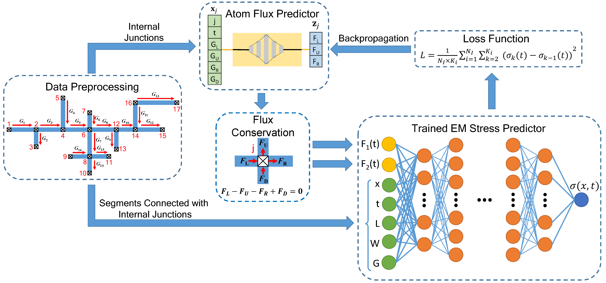

# HierPINN-EM

HierPINN-EM is a fast learning-based electromigration (EM) analysis method for multi-segment interconnects using hierarchical Physics-informed Neural Network (PINN)

- First Stage:

  The first step is to find a parameterized solution for single-segment wires under different boundary conditions, geometrical parameters and stressing current densities.

- Second Stage:
  
  Unsupervised PINN is applied to solve the stress and atom flux continuity problem in the interconnects by enforcing the physics laws at the boundaries of all wire segments.

- HierPINN-EM can significantly reduce the number of variables at the PINN solver, which leads to faster training speed and better accuracy than the plain PINN method.

First Stage | Second Stage
:-----:|:-----:
 | 


## Installation

HierPINN-EM requires TensorFlow 1.x to be installed as backend. It was tested on Fermi server in Anaconda virtual env with following dependencies:

- python=3.8.12
- scipy=1.7.3
- pytorch=1.7.1 (build=py3.8_cuda11.0.221_cudnn8.0.5_0)
- cudatoolkit=11.0.221
- numpy=1.21.5
- matplotlib=3.5.1

To enable the gpu version of pytorch, please install pytorch using following command on Fermi (GPU: TITAN RTX, Driver: NVIDIA-SMI 450.51.05  Driver Version: 450.51.05  CUDA Version: 11.0):
```
$ conda install pytorch==1.7.1 torchvision==0.8.2 torchaudio==0.7.2 cudatoolkit=11.0 -c pytorch
```

## Instructions
- Random Interconnects Generation:

  Generate multi-segment interconnect trees and COMSOL results by following the instructions in [Random Interconnects Generation](https://github.com/wtjin1992/Random_Interconnects_Gen).
  
  First, run `line.py` to create multi-segment straight wires or run `autoGenGeo_correct.py` to create multi-segment interconnect trees. The results are saved in `.geo` and `.mat` files inside `/data` folder.

  Second, launch Matlab on server with command `comsol mphserver matlab` and run `simulate.m` in Matlab. The Comsol results will be filled into `.mat` files inside `/data` folder.

- First Stage:

  Run `first_stage_single_segment_stress_predictor.py` to train the stress predictor. The path to the random interconnects (training dataset) generated in the previous step should be passed through `--data-path` argument.

- Second Stage:

  Run `second_stage_atom_flux_predictor.py` to train the atom flux predictor. The path to the random interconnects (test set) should be passed through `--data-path` argument. The path to the trained first stage model should be passed through `--model-path` argument.

- An example first stage model is already trained using first 8000 cases in `/fermi_data/shared/wentian/hierpinn_em/EMdataset_10seg_1n2/` and the trained model is saved in `./ckpt/trial_function_mlp_20.pkl`. You can directly run the second stage `second_stage_atom_flux_predictor.py` on test set in `/fermi_data/shared/wentian/hierpinn_em/test_trees/` using the trained first stage model.

## Publications

```
To be added...
```

## The Team

HierPINN-EM was originally developed by [Wentian Jin](https://vsclab.ece.ucr.edu/people/wentian-jin) at [VSCLAB](https://vsclab.ece.ucr.edu/VSCLAB) under the supervision of Prof. [Sheldon Tan](https://profiles.ucr.edu/app/home/profile/sheldont).

HierPINN-EM is currently maintained by [Wentian Jin](https://vsclab.ece.ucr.edu/people/wentian-jin).

